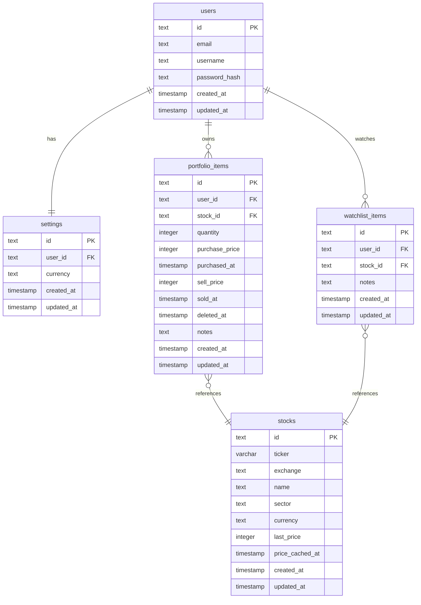

# Database

PostgreSQL via Drizzle ORM. Schema lives in `db/src/schema/`. Full design spec: [designs/designs.md](./designs/designs.md).

## Current tables



## Migrations

Generate a migration after changing the schema:

```bash
npm run db:generate -w @stockwise/db
```

Apply it to the database:

```bash
npm run db:migrate -w @stockwise/db
```

Migrations are stored in `db/src/migrations/`.
