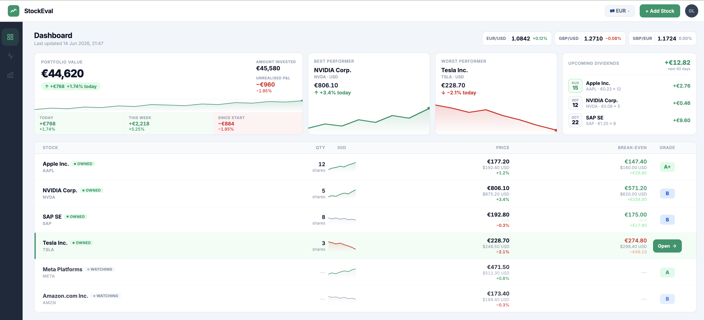
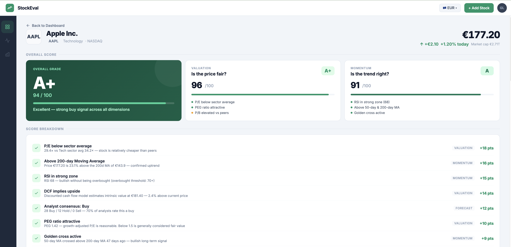
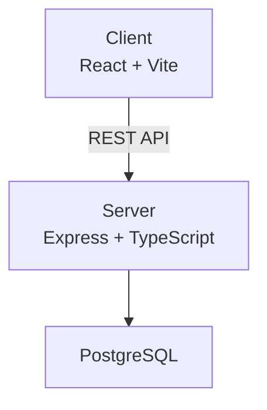

# Stockwise


> A stock evaluation app that scores equities based on financial fundamentals.

---

## What it does

Stockwise fetches financial data for any ticker and runs it through a set of scoring rules based on key indexes — things like P/E ratio, debt-to-equity, earnings growth, and dividend yield. Each stock gets a composite score so you can quickly assess whether it's worth a closer look.

The goal is to build something that actually does analysis, not just displays numbers.

---

## Design

> These are design mockups. The app is currently in development.




---

## Stack

| Layer | Technology |
|---|---|
| Frontend | React + Vite + TypeScript |
| Backend | Express + TypeScript |
| Database | PostgreSQL + Drizzle ORM |
| Testing | Jest + React Testing Library |

---

## Architecture



---

## Project structure

```
stockwise/
├── client/             # React + Vite frontend
│   └── src/
├── server/             # Express API
│   └── src/
├── db/                 # Drizzle ORM — schema, migrations, db client
│   └── src/
│       ├── schema/
│       └── migrations/
├── docker-compose.yml
└── .env.example
```

---

## Running locally

```bash
# Frontend
cd client && npm install && npm run dev

# Backend
cd server && npm install && npm run dev
```

---

## Testing

```bash
# Server — run once
cd server && npm test

# Server — watch mode
cd server && npm run test:watch

# Client — run once
cd client && npm test

# Client — watch mode
cd client && npm run test:watch
```

---

## CI

Runs on every push and PR to `master`. Skips on docs and image changes.

| Job | Steps |
|---|---|
| Server | install → type-check → build → test |
| Client | install → type-check → lint → build → test |

See [DEVELOPMENT.md](./DEVELOPMENT.md) for full conventions.
