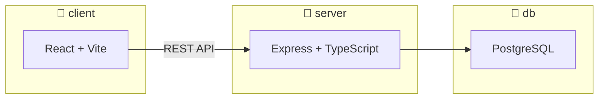

# Stockwise


> A stock evaluation app that scores equities based on financial fundamentals.

---

## What it does

Stockwise fetches financial data for any ticker and runs it through a set of scoring rules based on key indexes — things like P/E ratio, debt-to-equity, earnings growth, and dividend yield. Each stock gets a composite score so you can quickly assess whether it's worth a closer look.

The goal is to build something that actually does analysis, not just displays numbers.

---

## Design

> These are design mockups. The app is currently in development.


---

## Stack

| Layer | Technology |
|---|---|
| Frontend | React + Vite + TypeScript + shadcn/ui |
| Backend | Express + TypeScript |
| Database | PostgreSQL + Drizzle ORM |
| Testing | Jest + React Testing Library |

---

## Architecture



---

## Project structure

```
stockwise/
├── client/             # React + Vite frontend
│   └── src/
│       ├── components/
│       │   └── ui/     # shadcn/ui base components
│       ├── pages/      # route-level page components
│       └── lib/        # shared utilities (cn, etc.)
├── server/             # Express API
│   └── src/
├── shared/             # shared types and utilities (used by client and server)
├── db/                 # Drizzle ORM — schema, migrations, db client
│   └── src/
│       ├── schema/
│       └── migrations/
├── docker-compose.yml
└── .env.example
```

---

## Running locally

Requires Docker. Copy `.env.example` to `.env` and fill in credentials before first run.

```bash
docker compose up --build
```

All three services start together: PostgreSQL, the Express server, and the React client.

To run without Docker:

```bash
# Frontend
npm run dev -w client

# Backend
npm run dev -w server
```

---

## Testing

```bash
# Server
npm test -w server
npm run test:watch -w server

# Client
npm test -w client
npm run test:watch -w client

# Shared
npm test -w shared
npm run test:watch -w shared
```

---

## CI

Runs on every push and PR to `master`. Includes format check, lint, type-check, build, and test across all packages. Security audit runs every 5 days. Dependabot opens weekly dependency update PRs.


## More resources

See [DEVELOPMENT.md](./DEVELOPMENT.md) for full conventions.
See [DATABASE.md](./DATABASE.md) for schema, tables, and relationships.
